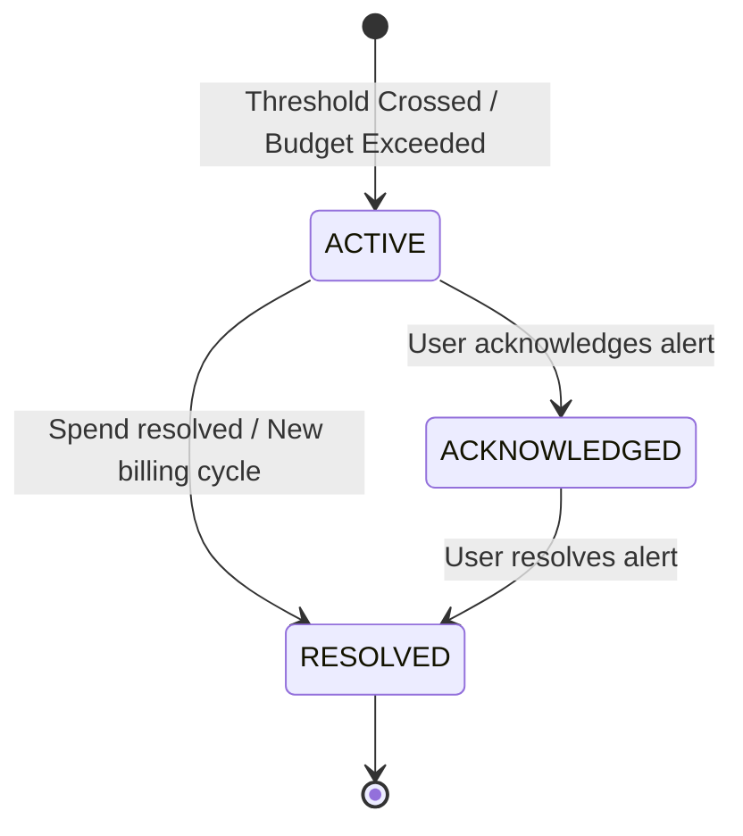

# OsterdOps Operational Alert Engine (Phase 12)

The **OsterdOps Alert Engine** detects budget threshold crossings, generates deduplicated alert records, and manages the alert resolution lifecycle.

---

## 1. Alert Lifecycle & State Transitions

---

## 2. Deterministic Deduplication Strategy

To prevent spamming or duplicated alert records across concurrent evaluations:

$$\text{dedupKey} = \text{org\_}\{\text{orgId}\}\_\text{bud\_}\{\text{budgetId}\}\_\text{period\_}\{\text{periodStart}\}\_\text{thresh\_}\{\text{thresholdPercent}\}$$

- **One alert per threshold per period cycle**.
- Re-evaluations during the same billing cycle check the existing active/acknowledged alert and suppress duplicates.
- Transitioning to the next calendar period naturally creates a fresh alert identity.

---

## 3. Alert Severity & Types

| Threshold | Alert Type | Severity | Description |
| :--- | :--- | :--- | :--- |
| **< 75%** (e.g. 50%) | `BUDGET_THRESHOLD` | `INFO` | Informational milestone |
| **75% – 89%** | `BUDGET_THRESHOLD` | `WARNING` | Approaching budget limit |
| **90% – 99%** | `BUDGET_THRESHOLD` | `CRITICAL` | Imminent budget exhaustion |
| **100%+** | `BUDGET_EXCEEDED` | `CRITICAL` | Limit reached or exceeded |

---

## 4. REST API Endpoints

| Method | Path | Permission | Description |
| :--- | :--- | :--- | :--- |
| `GET` | `/api/v1/alerts` | `alerts:read` | List alerts with bounded filters |
| `GET` | `/api/v1/alerts/[alertId]` | `alerts:read` | Get alert details |
| `POST` | `/api/v1/alerts/[alertId]/acknowledge` | `alerts:manage` | Transition to `ACKNOWLEDGED` |
| `POST` | `/api/v1/alerts/[alertId]/resolve` | `alerts:manage` | Transition to `RESOLVED` |
