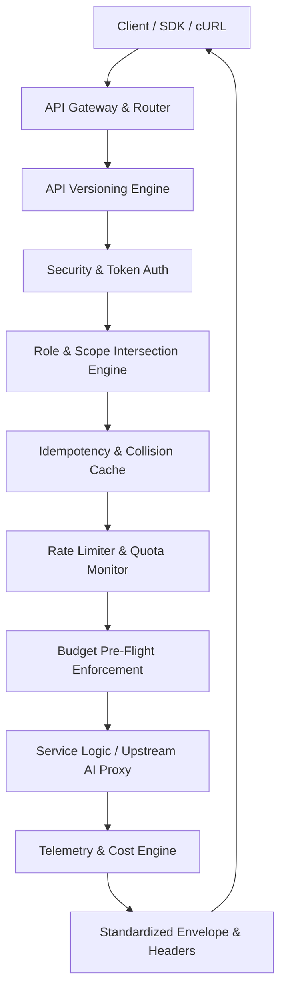

# OsterdOps Enterprise API Platform Architecture (Phase 18)

OsterdOps delivers a modern, high-throughput, enterprise-grade developer API platform built on top of resilient microservices and zero-trust security foundations.

---

## 1. Platform Architectural Layers

---

## 2. Core Pillars

1. **Deterministic Cost Governance**: Exact $/1M token pricing calculation and zero-leak budget ceilings.
2. **Standardized Envelopes**: Consistent `{ data, meta, requestId }` and `{ error: { code, message, requestId, details } }` contracts.
3. **Idempotency & Replay Protection**: Collision-free mutation replays with `Idempotency-Key` headers.
4. **Tenant-Safe Cursor Pagination**: Base64 JSON cursor serialization with tenant ownership checks.
5. **Signed Webhooks**: HMAC-SHA256 signature verification with 5-minute replay attack windows.
