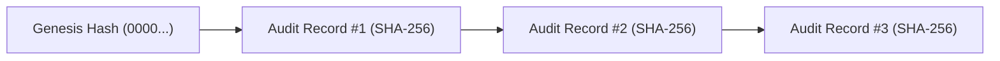

# OsterdOps Tamper-Evident Audit Log Architecture (Phase 15)

---

## 1. Cryptographic Hash Chaining Mechanism

For each record $R_i$:
$$H_i = \text{HMAC-SHA256}\left(K, H_{i-1} \,\|\, \text{Canonical}(R_i)\right)$$

Where $\text{Canonical}(R_i)$ is deterministic JSON with sorted dictionary keys.

---

## 2. Integrity Verification
The verification algorithm `verifyAuditChain()` checks:
1. Every record's `previousHash` precisely matches $H_{i-1}$.
2. Every record's `currentHash` matches the cryptographic digest over its canonical payload.
3. Sequential order is unbroken.

Any modified record, deleted entry, or injected event immediately invalidates all subsequent hash links.
