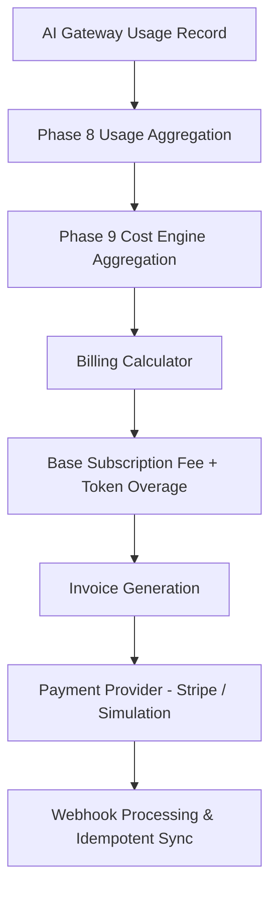

# OsterdOps Billing & Revenue Engine (Phase 13)

The **OsterdOps Billing Engine** manages subscription plans, organization billing accounts, usage-based token overages, recurring charges, invoice lifecycles, and payment-provider integrations (Stripe + simulation).

---

## 1. Billing Architecture & Core Pipeline

### Core Separation of Concerns:
- **Budget Engine (Phase 12)**: Enforces spending caps (e.g. `$500/month` limit, blocking upstream requests when exceeded).
- **Billing Engine (Phase 13)**: Calculates recurring subscription amounts, included usage allowances, token overages, and payment collection.

---

## 2. Centralized Versioned Plans

| Plan | Monthly (USD) | Annual (USD) | Included Tokens | Included Requests | Gateway Rate Limit | Overage Rate (per 1M tokens) |
| :--- | :--- | :--- | :--- | :--- | :--- | :--- |
| **FREE** | $0 | $0 | 100,000 | 1,000 | 60 RPM | N/A (Hard Cap) |
| **PRO** | $49 | $470 | 5,000,000 | 50,000 | 300 RPM | $3.50 |
| **BUSINESS** | $199 | $1,910 | 25,000,000 | 250,000 | 1,200 RPM | $2.50 |
| **ENTERPRISE** | $999 | $9,590 | 200,000,000 | 2,000,000 | 6,000 RPM | $1.50 |

---

## 3. Financial Calculations & Integer Precision

All monetary totals are computed using exact integer-cents arithmetic to prevent floating-point rounding errors:

$$\text{Subtotal (cents)} = \text{round}(\text{basePriceUsd} \times 100) + \text{round}(\text{overageSpendUsd} \times 100)$$
$$\text{Total (cents)} = \max(0, \text{Subtotal} - \text{Credits})$$

---

## 4. REST API Endpoints

| Method | Path | Permission | Description |
| :--- | :--- | :--- | :--- |
| `GET` | `/api/v1/billing` | `billing:read` | Consolidated billing summary & real-time estimates |
| `GET` | `/api/v1/billing/subscription` | `billing:read` | Active subscription details & current plan |
| `POST` | `/api/v1/billing/subscription` | `billing:manage` | Initialize subscription |
| `PATCH` | `/api/v1/billing/subscription` | `billing:manage` | Change subscription plan or billing interval |
| `POST` | `/api/v1/billing/subscription/cancel` | `billing:manage` | Cancel subscription |
| `POST` | `/api/v1/billing/subscription/reactivate` | `billing:manage` | Reactivate subscription pending cancellation |
| `GET` | `/api/v1/billing/invoices` | `billing:read` | List organization invoices |
| `GET` | `/api/v1/billing/invoices/[invoiceId]` | `billing:read` | Get specific invoice breakdown |
| `GET` | `/api/v1/billing/usage` | `billing:read` | Token usage & overage calculation for cycle |
| `POST` | `/api/v1/billing/checkout` | `billing:manage` | Create Stripe checkout session |
| `POST` | `/api/v1/billing/webhooks/stripe` | Public | Signature-verified webhook receiver |
