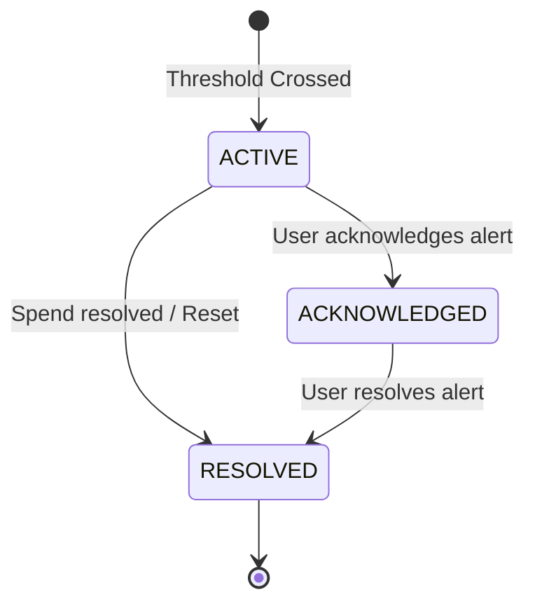

# OsterdOps Budgets, Spend Limits & Alert Engine — Architecture & Documentation

The **OsterdOps Budget & Alert Engine** allows organizations to define spending targets, monitor spend against authoritative Phase 9 Cost Engine metrics, and generate deduplicated threshold alerts.

---

## 1. Primary Evaluation Pipeline

```
Customer AI Request
       ↓
UsageRecord (Phase 8)
       ↓
CostRecord (Phase 9)
       ↓
aggregateSpend() (Authoritative USD Metrics)
       ↓
Budget Evaluator (Deterministic UTC Period Boundaries)
       ↓
Threshold Crossing Detection (50%, 75%, 90%, 100%)
       ↓
Deduplicated Alert Generation (Deterministic Key)
       ↓
In-App Notifications & Audit Trail
```

> [!NOTE]
> **Monitoring vs. Enforcement**:
> Phase 10 operates in **`MONITOR`** mode. AI gateway requests are not blocked by budget thresholds. Request blocking will be enabled as an opt-in policy in future phases.

---

## 2. Budget Model & Periods

```typescript
export type BudgetPeriod = "DAILY" | "WEEKLY" | "MONTHLY" | "CUSTOM";
export type BudgetStatus = "ACTIVE" | "PAUSED" | "EXCEEDED" | "ARCHIVED";
export type EnforcementMode = "MONITOR" | "BLOCK";

export interface Budget {
  id: string;
  organizationId: string;
  projectId?: string;        // Optional project scope
  name: string;
  description?: string;
  amountUsd: number;         // Monetary target in USD
  currency: string;          // Default: "USD"
  period: BudgetPeriod;
  periodStart: string;       // ISO 8601 UTC
  periodEnd?: string;        // ISO 8601 UTC
  thresholds: number[];      // e.g. [50, 75, 90, 100]
  triggeredThresholds: number[];
  enabled: boolean;
  enforcementMode: EnforcementMode; // Default: "MONITOR"
  status: BudgetStatus;
  createdBy?: string;
  createdAt: string;
  updatedAt: string;
}
```

### Deterministic UTC Period Boundaries
All periods are calculated using canonical UTC timestamps:
- **`DAILY`**: `YYYY-MM-DDT00:00:00.000Z` to `YYYY-MM-DDT23:59:59.999Z`
- **`WEEKLY`**: Monday `00:00:00.000Z` to Sunday `23:59:59.999Z`
- **`MONTHLY`**: 1st of month `00:00:00.000Z` to last day of month `23:59:59.999Z`
- **`CUSTOM`**: Explicit ISO 8601 `periodStart` and `periodEnd`.

---

## 3. Threshold Engine & Severity Mapping

| Threshold (%) | Alert Type | Severity Tier | Action |
| :--- | :--- | :--- | :--- |
| **50%** | `BUDGET_THRESHOLD` | `INFO` | Emits info notification |
| **75%** | `BUDGET_THRESHOLD` | `WARNING` | Emits warning notification |
| **90%** | `BUDGET_THRESHOLD` | `CRITICAL` | Emits high-priority alert |
| **100%+** | `BUDGET_EXCEEDED` | `CRITICAL` | Marks budget as `EXCEEDED` |

---

## 4. Deterministic Alert Deduplication

To prevent duplicate alerts during continuous evaluations, each alert identity is deterministically constructed:

$$\text{dedupKey} = \text{org\_}\{\text{orgId}\}\_\text{bud\_}\{\text{budgetId}\}\_\text{period\_}\{\text{periodStart}\}\_\text{thresh\_}\{\text{thresholdPercent}\}$$

### Deduplication Rules:
1. **Single Alert per Threshold per Cycle**: A $100 budget crossing 75% creates one alert with document ID matching `dedupKey`. Subsequent evaluations in the same month detect the existing active/acknowledged alert and suppress duplicates.
2. **Cycle Reset**: When a new budget period starts (e.g. next calendar month), `periodStart` advances, generating fresh alert identities for the new period.
3. **Acknowledgment Persistence**: Acknowledging an alert transitions status to `ACKNOWLEDGED` without triggering re-alerting if spend remains above the threshold.

---

## 5. Alert Model & Lifecycle

```typescript
export type AlertStatus = "ACTIVE" | "ACKNOWLEDGED" | "RESOLVED";

export interface Alert {
  id: string;                 // Matches dedupKey
  organizationId: string;
  projectId?: string;
  budgetId?: string;
  type: "BUDGET_THRESHOLD" | "BUDGET_EXCEEDED";
  thresholdPercent: number;
  budgetAmountUsd: number;
  currentSpendUsd: number;
  remainingUsd: number;
  overspendUsd?: number;
  periodStart: string;
  periodEnd: string;
  severity: "INFO" | "WARNING" | "CRITICAL";
  title: string;
  message: string;
  dedupKey: string;
  status: AlertStatus;
  createdAt: string;
  acknowledgedAt?: string;
  acknowledgedBy?: string;
  resolvedAt?: string;
  resolvedBy?: string;
}
```



---

## 6. Spend Calculation & Unknown Pricing

The Budget Engine evaluates authoritative spend via Phase 9 `aggregateSpend(orgId, { projectId, startDate, endDate })`.

### Pricing Coverage Metadata
If any requests passed through the gateway with unrecognized models (`pricingStatus: "UNAVAILABLE"`), they are tracked via `pricingCoverage`:
```json
{
  "pricingCoverage": {
    "pricedRequests": 1420,
    "unpricedRequests": 0,
    "pricedSpendUsd": 76.42
  }
}
```
This guarantees that missing pricing data is explicitly reported rather than silently assumed as $0.00.

---

## 7. Multi-Tenant Firestore Schema

- **Budgets**: `organizations/{organizationId}/budgets/{budgetId}`
- **Alerts**: `organizations/{organizationId}/alerts/{alertId}`

### Firestore Indexes
| Collection | Fields Indexed | Query Purpose |
| :--- | :--- | :--- |
| `budgets` | `organizationId ASC, createdAt DESC` | List organization budgets |
| `budgets` | `organizationId ASC, projectId ASC, createdAt DESC` | List project-scoped budgets |
| `alerts` | `organizationId ASC, createdAt DESC` | List active alerts chronologically |
| `alerts` | `organizationId ASC, status ASC, createdAt DESC` | Filter alerts by status |
| `alerts` | `organizationId ASC, severity ASC, createdAt DESC` | Filter alerts by severity |

---

## 8. REST API Endpoints

### Budget Endpoints
| Method | Path | Permission | Description |
| :--- | :--- | :--- | :--- |
| `GET` | `/api/v1/budgets` | `budgets:read` | Lists all organization budgets |
| `POST` | `/api/v1/budgets` | `budgets:manage` | Creates a new budget |
| `GET` | `/api/v1/budgets/[budgetId]` | `budgets:read` | Retrieves budget configuration |
| `PATCH` | `/api/v1/budgets/[budgetId]` | `budgets:manage` | Updates budget parameters |
| `DELETE` | `/api/v1/budgets/[budgetId]` | `budgets:manage` | Deletes budget |
| `POST` | `/api/v1/budgets/[budgetId]/evaluate` | `budgets:read` | Forces budget evaluation |
| `GET` | `/api/v1/budgets/[budgetId]/status` | `budgets:read` | Retrieves real-time utilization |

### Alert Endpoints
| Method | Path | Permission | Description |
| :--- | :--- | :--- | :--- |
| `GET` | `/api/v1/alerts` | `alerts:read` | Lists filtered alerts |
| `GET` | `/api/v1/alerts/[alertId]` | `alerts:read` | Retrieves alert details |
| `POST` | `/api/v1/alerts/[alertId]/acknowledge` | `alerts:manage` | Transitions alert to `ACKNOWLEDGED` |
| `POST` | `/api/v1/alerts/[alertId]/resolve` | `alerts:manage` | Transitions alert to `RESOLVED` |

---

## 9. RBAC Permission Matrix

| Role | `budgets:read` | `budgets:manage` | `alerts:read` | `alerts:manage` |
| :--- | :---: | :---: | :---: | :---: |
| **OWNER** | Allowed | Allowed | Allowed | Allowed |
| **ADMIN** | Allowed | Allowed | Allowed | Allowed |
| **DEVELOPER** | Allowed | Denied | Allowed | Denied |
| **VIEWER** | Allowed | Denied | Allowed | Denied |

---

## 10. Privacy & Security Guarantees

1. **Zero Prompt/Secret Persistence**: Budgets and Alerts never store prompt text, completions, API keys, or provider secrets.
2. **Server-Side Tenant Ownership**: `organizationId` supplied by clients is verified against authentication session context.
3. **Audit Trail**: Administrative actions (`BUDGET_CREATED`, `BUDGET_UPDATED`, `BUDGET_DELETED`, `ALERT_ACKNOWLEDGED`, `ALERT_RESOLVED`) are securely logged.
