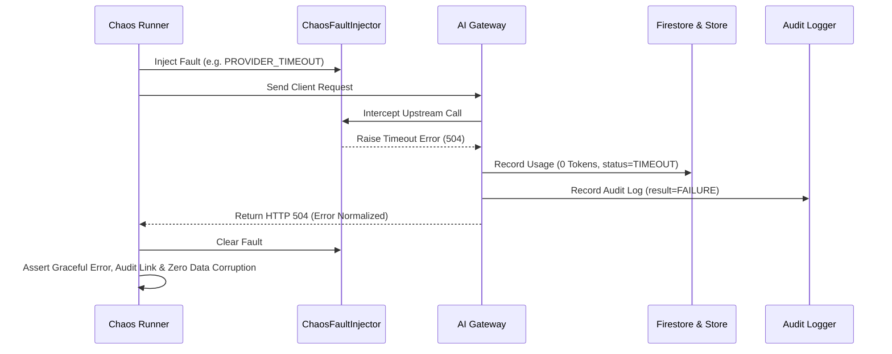

# OsterdOps — Chaos Engineering & Failure Simulation Engine

## 1. Core Principles

The OsterdOps Chaos Engineering Engine injects controlled faults across upstream providers, database replicas, caching layers, message queues, and billing systems to evaluate resilience before anomalies occur in production.

### Key Guarantees Under Failure
1. **Graceful Error Normalization**: No unhandled raw exceptions exposed to API clients.
2. **Zero Phantom Charges**: Outages record 0 tokens; customers are never charged for failed or timed-out requests.
3. **Audit Trail Persistence**: Every failure, degradation, or blocked request records an immutable tamper-evident audit entry.
4. **Zero Partial Writes**: Database transaction interruptions trigger atomic rollbacks with no orphaned records.
5. **Multi-Tenant Isolation**: A storm against Tenant A never exhausts Tenant B's rate limits or compute budget.

---

## 2. Injected Failure Modes

| Fault Type | Trigger Condition | System Response | Expected Status |
|---|---|---|---|
| `PROVIDER_TIMEOUT` | Upstream provider exceeds deadline (e.g. 60s) | Gateway returns 504 with `TIMEOUT` code; records 0 tokens in usage | HTTP 504 |
| `PROVIDER_500` | Upstream provider returns internal error | Normalized to `BAD_GATEWAY` (502); metrics increment error counter | HTTP 502 |
| `PROVIDER_429` | Upstream provider rate limits | Mapped to `PROVIDER_RATE_LIMITED` with retryable flag | HTTP 429 |
| `DATABASE_UNAVAILABLE` | Firestore replica unreachable | Atomic write aborts cleanly; zero partial records; safe retry | HTTP 500 / Safe Error |
| `FIRESTORE_TIMEOUT` | Write transaction takes too long | Transaction aborted; client receives retryable error | HTTP 504 |
| `REDIS_FAILURE` | Distributed Redis instance unreachable | Rate limiter transparently falls back to local in-memory sliding window | Transparent (200/429) |
| `QUEUE_FAILURE` | Async job worker offline | Jobs persist in durable storage and retry via exponential backoff | Safe Retry |
| `ANALYTICS_FAILURE` | Analytics aggregation worker degrades | Request still succeeds; usage record persists safely | HTTP 200 |
| `BILLING_FAILURE` | Payment provider API down | Billing reconciliation queued for automatic replay | Safe Queue |
| `NOTIFICATION_FAILURE` | Outbound webhook endpoint unreachable | Webhook delivery retries with exponential backoff and dead-letter queue | Safe Retry |

---

## 3. Chaos Simulation Lifecycle

