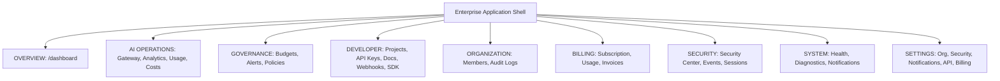

# OsterdOps Enterprise Control Plane Architecture (Phase 19)

OsterdOps delivers a unified enterprise control plane providing deterministic AI routing, spend governance, real-time threshold guardrails, and cryptographic security management.

---

## 1. Control Plane Navigation Hierarchy

---

## 2. Core Pillars

1. **Deterministic Telemetry**: Real-time spending charts, model usage analytics, and token metrics powered by Phase 11 cost calculation engines.
2. **Server-Authoritative RBAC**: Client-side `can()` and `RbacGuard` manage UI rendering only; all API routes strictly enforce `requireOrganizationMember`.
3. **Zero-Content Retention**: Prompts, completions, raw keys (post-creation), and provider secrets are never stored, logged, or exposed in URLs.
4. **Tamper-Evident Auditing**: SHA-256 cryptographic hash-chained audit trails with immutable verification.
