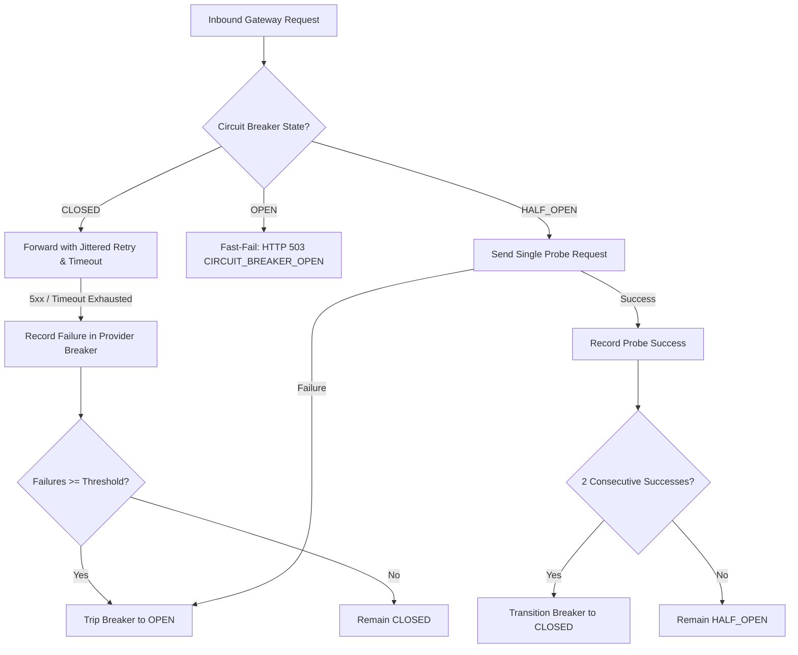

# OsterdOps — Production Reliability, Resilience & Disaster Readiness (Phase 29)

This document specifies the authoritative disaster recovery runbooks, failure isolation models, data durability guarantees, and operational recovery procedures for the OsterdOps platform.

---

## 1. Objectives & Metrics Targets

- **Recovery Point Objective (RPO)**: $< 5\text{ minutes}$ for Usage, Financial transactional data, and Audit trails.
- **Recovery Time Objective (RTO)**: $< 15\text{ minutes}$ for full AI Gateway request routing restoration in alternate availability zones.
- **SLO Target**: $99.9\%$ successful gateway request availability over a rolling 15-minute window.

---

## 2. Data Durability Model: Persistent vs In-Memory Boundaries

OsterdOps strictly delineates between **Durable (Persistent)** storage and **Volatile (In-Memory)** structures. Operational teams must understand what survives a container crash or process restart:

| Subsystem | Storage Mechanism | Durability Guarantee | Crash/Restart Recovery Behavior |
| :--- | :--- | :--- | :--- |
| **Organizations, Projects, Members** | Google Cloud Firestore | **DURABLE** (Multi-region PITR) | Fully preserved; immediately available on restart. |
| **API Keys (SHA-256 Hashes)** | Google Cloud Firestore | **DURABLE** (Encrypted/Hashed) | Fully preserved; zero credential loss. |
| **Usage Records (`organizations/{id}/usage`)** | Google Cloud Firestore | **DURABLE** | Keyed by `requestId`; idempotent against replay. |
| **Cost Records (`organizations/{id}/costs`)** | Google Cloud Firestore | **DURABLE** | Keyed by `usageId`; idempotent against replay. |
| **Audit Logs (`organizations/{id}/audit_logs`)** | Google Cloud Firestore | **DURABLE** (Cryptographic chain) | Hash-chained and immutable across restarts. |
| **Budgets & Threshold Alerts** | Google Cloud Firestore | **DURABLE** | Evaluated transactionally from durable spend. |
| **Circuit Breakers** | Node.js Process Memory | **IN-MEMORY (VOLATILE)** | Resets to `CLOSED` on fresh process start; trips on active traffic. |
| **LRU Cache Registry** | Node.js Process Memory | **IN-MEMORY (VOLATILE)** | Rebuilt on-demand; TTL bounded ($10\text{s}$ to $1\text{h}$). |
| **Job Queue (`MemoryJobQueue`)** | Node.js Process Memory | **IN-MEMORY (VOLATILE)** | **LIMITATION**: Process crash before drain loses uncommitted in-memory jobs. External Redis/PubSub required for distributed durable job persistence across cold restarts. |
| **Rate Limit Counters (`MemoryStore`)** | Node.js Process Memory | **IN-MEMORY (VOLATILE)** | Falls back to local sliding-window; Redis adapter available for distributed state. |

---

## 3. Dependency Health & Probe Semantics

OsterdOps exposes standardized liveness and readiness health endpoints designed for container orchestrators (Kubernetes, Cloud Run, ECS) and reverse proxies.

### Probe Status Matrix

| Endpoint | Probe Type | HTTP Status | Response State | Operational Meaning |
| :--- | :--- | :--- | :--- | :--- |
| `/api/health` | Liveness | `200 OK` | `LIVE` | The Node.js event loop and runtime process are alive. |
| `/api/ready` | Readiness | `200 OK` | `READY` | All core dependencies, configuration, and rate-limiters are healthy. |
| `/api/ready` | Readiness | `200 OK` | `DEGRADED` | The service is accepting traffic, but one or more upstream providers are failing (circuits open) or background jobs have dead-letters. |
| `/api/ready` | Readiness | `503 Service Unavailable` | `UNAVAILABLE` | Fatal configuration error or critical dependency failure; orchestrator must redirect ingress traffic. |

> [!IMPORTANT]
> **Zero Information Disclosure**: Health and readiness endpoints never expose API keys, provider tokens, internal filesystem paths, or confidential customer context.

---

## 4. Upstream AI Provider Failure Isolation & Self-Healing

When an upstream model provider (OpenAI, Anthropic, Gemini, Azure, Bedrock) suffers an outage or latency degradation:



### Provider Isolation Guarantees
- **Strict Per-Provider Namespacing**: Every provider has an independent `CircuitBreaker` instance. An outage on OpenAI has **zero effect** on Anthropic, Gemini, Azure, or Bedrock.
- **Fail-Fast Protection**: Once tripped to `OPEN`, requests fail in $< 1\text{ms}$ without consuming outbound socket connections, HTTP timeouts ($60\text{s}$), or retry backoffs.
- **Adaptive Recovery Probing**: After a recovery window ($30\text{s}$ default), the circuit transitions to `HALF_OPEN` and admits limited probe requests to confirm provider recovery before closing.

---

## 5. Failure Containment Architecture

A core principle of OsterdOps reliability is **Failure Containment**: non-critical background subsystems must never crash or interrupt the main request path.

| Subsystem | Criticality | Failure Behavior |
| :--- | :--- | :--- |
| **API Key Authentication & RBAC** | **CRITICAL** | Request halted; HTTP 401/403 returned. Security cannot fail-open. |
| **Hard Budget Enforcement** | **CRITICAL** | Request halted; HTTP 429 BUDGET_EXCEEDED returned when over hard limit. Financial safety cannot fail-open. |
| **Provider HTTP Execution** | **CRITICAL** | Normalized into standardized `GatewayErrorPayload` with clean status codes. |
| **Usage & Cost Ingestion** | **IMPORTANT** | Keyed by `requestId`; asynchronous persistence isolated with `.catch()`. |
| **Operational Metrics & Telemetry** | **NON_CRITICAL** | Wrapped in try/catch; logging failure or counter failure is silently contained and never aborts the gateway response. |
| **Notifications & Webhooks** | **NON_CRITICAL** | Dispatched via background job queue with exponential backoff; failures go to dead-letter queue. |
| **Cache Registry** | **NON_CRITICAL** | On cache read/write error, seamlessly falls through to authoritative Firestore store. |

---

## 6. Ingestion Idempotency & Financial Safety

To protect against duplicate request delivery, client retries, and network replays:
- **Usage Records**: Persisted under `organizations/{orgId}/usage/{requestId}`. Before incrementing project and organization token/request counters, OsterdOps verifies whether the document already exists. If present, existing data is returned idempotently without double-incrementing counters.
- **Cost Records**: Persisted under `organizations/{orgId}/costs/{usageId}`. Idempotency checks prevent duplicate financial spend increments.
- **Alert Records**: Keyed deterministically by `dedupKey`. Duplicate alerts for the same period are suppressed.

---

## 7. Job Queue Recovery Runbook

When background jobs fail (e.g. downstream webhook endpoint down, transient notification failure):

1. **Automatic Exponential Retries**: Jobs with retryable errors retry with bounded exponential backoff ($2^a \times 500\text{ms}$).
2. **Dead-Letter Segregation**: After exhausting `maxAttempts` (default: 3), jobs transition to `DEAD_LETTER` status.
3. **Manual / Programmatic Replay**:
   ```typescript
   import { getJobQueue } from "@/lib/jobs/registry";
   
   // Replay a specific dead letter
   await getJobQueue().retryDeadLetter(jobId);
   
   // Batch replay all dead letters after downstream recovery
   const requeuedCount = await getJobQueue().requeueAllDeadLetters();
   ```
4. **Interrupted Worker Recovery**: Jobs left in `PROCESSING` status during an abrupt worker abort or process shutdown are automatically recovered back to `PENDING` via `recoverInterruptedJobs()`.

---

## 8. Graceful Shutdown & Process Termination

OsterdOps registers process signal handlers for `SIGTERM` and `SIGINT`:

1. **Signal Interception**: Incoming termination signal triggers `performGracefulShutdown({ timeoutMs: 10000 })`.
2. **Sequential Cleanup**:
   - Drains pending background job queue batch (`JobQueueDrain`).
   - Recovers any in-flight interrupted jobs back to `PENDING`.
   - Prunes expired cache entries across all registries (`CachePruning`).
   - Emits final telemetry snapshot (`TelemetrySnapshot`).
3. **Idempotency**: Repeated or concurrent signals return the existing active shutdown promise, avoiding race conditions.
4. **Bounded Deadline**: A strict $10\text{s}$ timeout ensures processes never hang indefinitely.

---

## 9. Total Dependency Failure Recovery Scenarios

### Scenario A: Complete Firestore Outage
- **Gateway Behavior**: In-memory cached API keys and budget preflights continue to serve traffic for cached keys until TTL expiration ($30\text{s}$ to $60\text{s}$).
- **Ingestion Path**: New usage/cost records fail soft in background queue without dropping active HTTP streams.
- **Readiness Probe**: `/api/ready` drops to `503 UNAVAILABLE`, alerting upstream load balancers to route traffic to alternate regions.

### Scenario B: Cascading Upstream Provider Failure
- **Gateway Behavior**: Per-provider circuit breakers trip to `OPEN` within 5 failures. Subsequent requests fast-fail with HTTP 503.
- **Operator Action**: Upstream DNS/load balancers divert traffic to backup model deployments or providers.
- **Self-Healing**: Once the provider resumes healthy responses, probe requests in `HALF_OPEN` automatically close the circuit without requiring a service restart.

