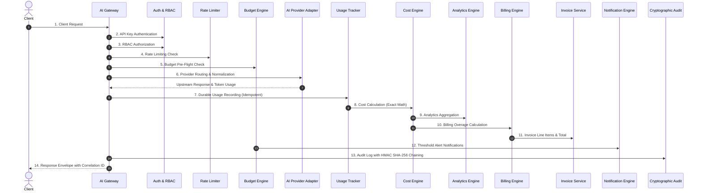

# OsterdOps — End-to-End Request Lifecycle & Integration Validation

## 1. 14-Stage Validation Lifecycle

Every client request passing through the OsterdOps platform undergoes 14 deterministic stages:



---

## 2. Validation Assertions by Stage

1. **Client Request**: Valid JSON payload structure, model specification, and temperature/token bounds.
2. **Authentication**: SHA-256 timing-safe hash comparison, valid active key status, and tenant binding.
3. **RBAC**: Role hierarchy evaluation (`OWNER`, `ADMIN`, `DEVELOPER`, `VIEWER`) and fine-grained scope permissions.
4. **Rate Limiting**: Sliding window counter decrement and header injection (`x-ratelimit-remaining`, `x-ratelimit-reset`).
5. **Budget Enforcement**: Spend limit verification; `HARD` budgets return HTTP 429 (`BUDGET_EXCEEDED`).
6. **Provider Routing**: Adapter formatting, upstream dispatch, response normalization, and exact token extraction.
7. **Usage Recording**: Multi-tenant partitioned storage, idempotent key mapping (`requestId`), zero prompt storage.
8. **Cost Calculation**: Integer arithmetic, model pricing lookup, and input/output/cached token cost splits.
9. **Analytics Aggregation**: Live KPI updates, percentile calculations, and daily time-series accumulation.
10. **Billing Calculation**: Plan quota deduction, overage rate computation, and integer-cents conversion.
11. **Invoice Generation**: Itemized subscription + overage charges, credit application, and transition to `PAID`.
12. **Notifications**: Threshold crossing detection (50%, 75%, 90%, 100%), deduplication keys, and channel preference filters.
13. **Audit Logging**: Deterministic HMAC SHA-256 hash chaining linked to the previous record hash.
14. **Response Returned**: Standardized JSON envelope, correlation ID matching, and zero secret leakage.

---

## 3. Reliability Scorecard (11 Categories)

```
========================================================================
OsterdOps Platform Reliability Scorecard: 100/100 (Grade: A+) — HEALTHY
========================================================================
- Authentication: 100/100 [EXCELLENT] (Weight: 10%)
- Authorization:  100/100 [EXCELLENT] (Weight: 10%)
- Gateway:        100/100 [EXCELLENT] (Weight: 10%)
- Usage:          100/100 [EXCELLENT] (Weight: 10%)
- Costs:          100/100 [EXCELLENT] (Weight: 10%)
- Budgets:        100/100 [EXCELLENT] (Weight: 10%)
- Billing:        100/100 [EXCELLENT] (Weight: 8%)
- Analytics:      100/100 [EXCELLENT] (Weight: 8%)
- Notifications:  100/100 [EXCELLENT] (Weight: 8%)
- Security:       100/100 [EXCELLENT] (Weight: 10%)
- Observability:  100/100 [EXCELLENT] (Weight: 6%)
========================================================================
```
