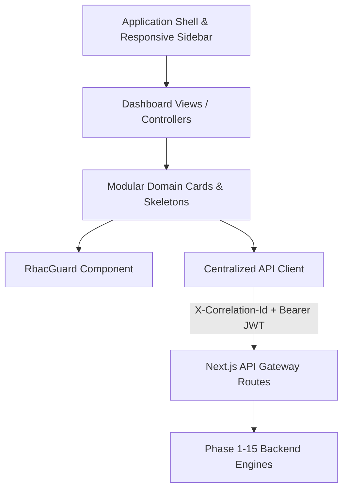

# OsterdOps Enterprise Frontend Architecture (Phase 16)

---

## 1. Architectural Principles

OsterdOps is designed as an enterprise infrastructure Control Center with high information density, strict separation of concerns, and robust server-authoritative state management.

---

## 2. Shell Navigation & State Hierarchy

The unified Application Shell (`src/components/layout/AppSidebar.tsx`) organizes capabilities into 7 enterprise domains:

1. **OVERVIEW**: Main operational dashboard (`/dashboard`)
2. **OBSERVABILITY**: Deep-dive analytics (`/dashboard/analytics`), real-time request telemetry (`/dashboard/requests`), latency percentiles (`/dashboard/latency`), connected providers (`/dashboard/providers`), model registry (`/dashboard/models`)
3. **COST GOVERNANCE**: Spend attribution (`/dashboard/costs`), budget enforcement (`/dashboard/budgets`), anomaly alerts (`/dashboard/alerts`)
4. **BILLING**: Subscriptions (`/dashboard/billing`), metered usage (`/dashboard/billing/usage`), invoices (`/dashboard/billing/invoices`)
5. **DEVELOPER**: Multi-tenant workspaces (`/dashboard/projects`), cryptographic API keys (`/dashboard/api-keys`), encrypted connections (`/dashboard/integrations`)
6. **SECURITY**: Posture evaluation (`/dashboard/security`), tamper-evident audit logs (`/dashboard/security/audit`), threat events (`/dashboard/security/events`), GDPR privacy controls (`/dashboard/security/privacy`)
7. **SYSTEM**: Notification feeds (`/dashboard/notifications`), organization policy (`/dashboard/settings`), reliability probes (`/dashboard/system`)

---

## 3. Data Ingestion & API Communication
- Centralized strongly-typed API dispatcher in `src/lib/api/client.ts`.
- Automatic propagation of `X-Correlation-Id` and `Authorization: Bearer <idToken>`.
- Client requests never log or leak raw secrets or prompt strings.
