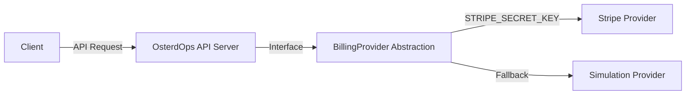

# OsterdOps Payment Provider Abstraction & Webhook Security (Phase 13)

This document describes the environment-driven payment provider architecture, Stripe integration, and webhook security.

---

## 1. Provider Architecture

---

## 2. Environment Variables

| Variable | Scope | Description |
| :--- | :--- | :--- |
| `STRIPE_SECRET_KEY` | Server-Only | Production Stripe API Secret Key (e.g. `sk_live_...` or `sk_test_...`) |
| `STRIPE_WEBHOOK_SECRET` | Server-Only | Stripe Webhook Signing Secret (e.g. `whsec_...`) |
| `NEXT_PUBLIC_STRIPE_PUBLISHABLE_KEY` | Public / Client | Stripe Publishable Key (e.g. `pk_live_...` or `pk_test_...`) |

> [!CAUTION]
> `STRIPE_SECRET_KEY` and `STRIPE_WEBHOOK_SECRET` must **never** be exposed in client bundles or public API responses.

---

## 3. Webhook Signature Verification

The Stripe webhook endpoint (`POST /api/v1/billing/webhooks/stripe`) validates the HMAC-SHA256 signature against the raw body:

1. Extracts timestamp `t` and signature `v1` from header `stripe-signature`.
2. Computes `HMAC-SHA256(secret, "${t}.${rawPayload}")`.
3. Performs constant-time comparison via `crypto.timingSafeEqual`.
4. Checks event ID in `system/webhooks/stripe/{eventId}` to ensure idempotent single-execution.
