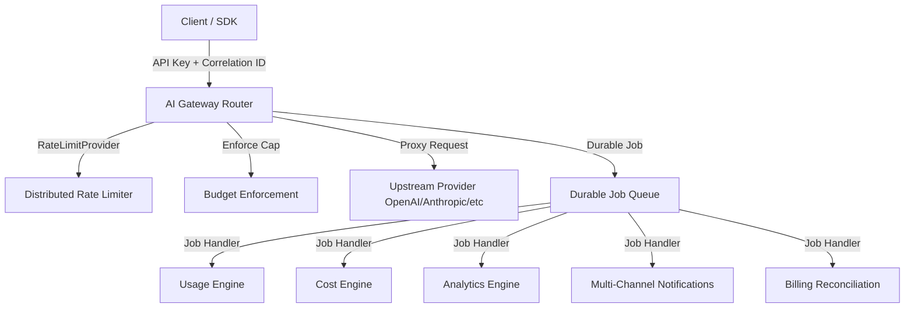

# OsterdOps Production Readiness & Launch Architecture (Phase 14)

This document outlines the production reliability foundations, distributed rate limiting, durable job processing, observability, and startup safety of the OsterdOps SaaS platform.

---

## 1. End-to-End Operational Pipeline

---

## 2. Distributed Rate Limiter
- **Interface**: `RateLimitProvider` (`src/lib/infrastructure/rate-limit/types.ts`).
- **Implementations**:
  - `memory`: High-throughput local sliding window limiter with automatic TTL bucket eviction.
  - `redis`: Distributed Redis-compatible adapter enabled with `OSTERDOPS_RATE_LIMIT_PROVIDER=redis`.
- **Fault-Tolerance**: Automatic graceful degradation to in-memory limiting during transient Redis network outages.

---

## 3. Durable Job Queue & Retry Architecture
- **Job Types**: `USAGE_RECORD`, `COST_RECORD`, `BUDGET_EVALUATION`, `ALERT_DISPATCH`, `NOTIFICATION_DISPATCH`, `BILLING_RECONCILIATION`.
- **Exponential Backoff**: Jittered delays ($t = \text{baseMs} \times 2^{\text{attempt}-1}$, capped at $\text{maxMs}$).
- **Classification**:
  - **Permanent Errors** (400, 401, 403, 404, invalid payload) $\rightarrow$ Fast dead-letter without wasteful retries.
  - **Transient Errors** (Network, 429, 500, 502, 503, 504, timeout) $\rightarrow$ Scheduled backoff retry up to `maxAttempts`.
- **Idempotency**: Strict deduplication via `idempotencyKey`.
