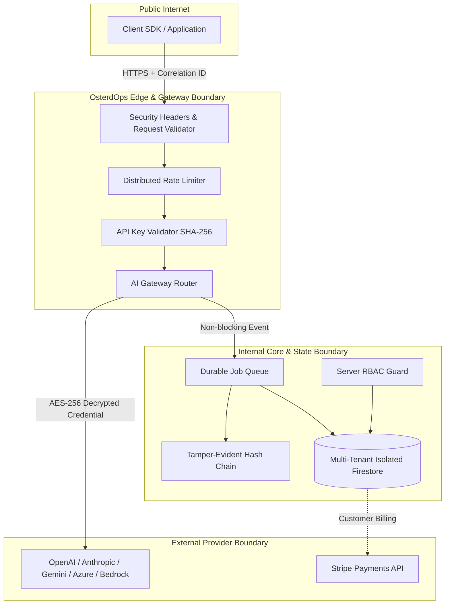

# OsterdOps Security Architecture & Trust Boundaries (Phase 15)

This document details the architectural boundaries, threat assumptions, and cryptographic defense-in-depth controls for the OsterdOps SaaS platform.

---

## 1. Architectural Trust Boundaries

---

## 2. Cryptographic Controls Summary

| Control | Algorithm / Protocol | Scope | Key Management |
| :--- | :--- | :--- | :--- |
| **Provider Credentials at Rest** | AES-256-GCM + IV + Auth Tag | `providerConnections` | `ENCRYPTION_KEY` via Environment/KMS |
| **Project API Keys** | SHA-256 One-Way Digest | `apiKeys.keyHash` | Plaintext discarded immediately after creation |
| **Audit Log Integrity** | HMAC-SHA256 Hash Chaining | `auditRecords` | Cryptographic hash chained to `previousHash` |
| **Stripe Webhook Verification** | HMAC-SHA256 Constant-Time Match | Stripe Webhooks | `STRIPE_WEBHOOK_SECRET` |
| **Privacy IP Pseudonymization** | Salted HMAC-SHA256 Hash | Security Events & Logs | Salted rotating hash, raw IPs never stored |

---

## 3. Residual Risks & Technical Mitigation
- **Prompt Content Leakage Prevention**: AI prompt/completion content is ephemeral in gateway process memory and strictly excluded from logging, database storage, audit logs, and metrics.
- **Timing Attacks**: All signature and key comparisons employ `crypto.timingSafeEqual`.
