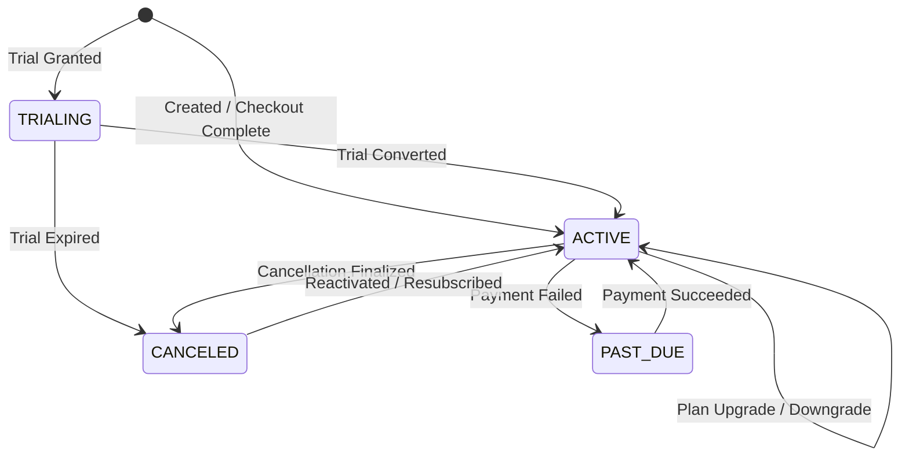

# OsterdOps Subscription Lifecycle & Entitlements (Phase 13)

This document details organization subscriptions, plan tier transitions, trial periods, and entitlement enforcement.

---

## 1. Subscription Lifecycle States

---

## 2. Entitlements Enforcement Matrix

| Entitlement | FREE | PRO | BUSINESS | ENTERPRISE |
| :--- | :--- | :--- | :--- | :--- |
| `maxProjects` | 2 | 10 | 50 | 1,000 |
| `maxMembers` | 2 | 10 | 50 | 1,000 |
| `includedTokens` | 100,000 | 5,000,000 | 25,000,000 | 200,000,000 |
| `includedRequests` | 1,000 | 50,000 | 250,000 | 2,000,000 |
| `gatewayRateLimitRpm` | 60 | 300 | 1,200 | 6,000 |
| `canUseAnalytics` | Allowed | Allowed | Allowed | Allowed |
| `canUseBudgets` | Allowed | Allowed | Allowed | Allowed |
| `canUseAdvancedAnalytics` | Denied | Allowed | Allowed | Allowed |
| `canUseAuditLogs` | Denied | Allowed | Allowed | Allowed |
| `canCreateApiKeys` | Allowed | Allowed | Allowed | Allowed |
| `overageEnabled` | Denied | Allowed | Allowed | Allowed |

---

## 3. Server-Side Security Invariant

- Entitlements and plan limits are **never** trusted from client parameters.
- The server resolves entitlements directly from the verified Firestore subscription document (`organizations/{orgId}/billing/subscription`).
- Inactive, past-due, or missing subscriptions automatically fall back to the safe `FREE` tier defaults.
