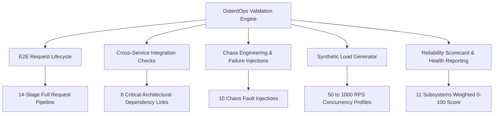

# OsterdOps — Comprehensive Testing & System Validation Architecture

## 1. Overview & Philosophy

OsterdOps Phase 21 establishes an end-to-end testing, integration verification, and failure simulation engine. Rather than relying solely on isolated unit tests, this framework validates the entire platform as a cohesive production system.

The core objective is to answer:
> **"Can OsterdOps survive production failures, maintain multi-tenant isolation, and remain strictly correct under real-world enterprise load?"**

---

## 2. Testing Framework Hierarchy



---

## 3. Subsystem Test Modules

| Module | Location | Purpose |
|---|---|---|
| **E2E Runner** | `src/lib/testing/e2e/e2e-runner.ts` | Orchestrates multi-stage scenario execution with timing and assertions |
| **Request Lifecycle** | `src/lib/testing/e2e/request-lifecycle.ts` | Validates synchronous-to-asynchronous 14-stage request flow |
| **Dependency Checks** | `src/lib/testing/integration/dependency-checks.ts` | Verifies cross-service data and event propagation |
| **Integration Runner** | `src/lib/testing/integration/integration-runner.ts` | Executes full dependency graph and compiles integration reports |
| **Chaos Fault Injector** | `src/lib/testing/chaos/failure-injection.ts` | Intercepts provider, database, redis, and queue calls |
| **Provider Outage** | `src/lib/testing/chaos/provider-outage.ts` | Simulates 504, 500, and 429 upstream provider failures |
| **Database Failure** | `src/lib/testing/chaos/database-failure.ts` | Simulates storage drops and asserts atomic rollback |
| **Rate Limit Storm** | `src/lib/testing/chaos/rate-limit-storm.ts` | Simulates high-volume traffic bursts and Redis fallbacks |
| **Load Generator** | `src/lib/testing/load/load-generator.ts` | Measures throughput, p50/p90/p95/p99 latency, and errors |
| **Reliability Scorecard** | `src/lib/testing/reporting/scorecard.ts` | Evaluates platform health across 11 critical categories |
| **Report Builder** | `src/lib/testing/reporting/report-builder.ts` | Formats comprehensive Markdown summaries |

---

## 4. Execution Commands

```bash
# Execute entire OsterdOps unit, E2E, integration, chaos & load suites
npm run test

# Validate TypeScript type safety
npx tsc --noEmit

# Run code style & linting checks
npm run lint

# Validate production Next.js build
npm run build
```
